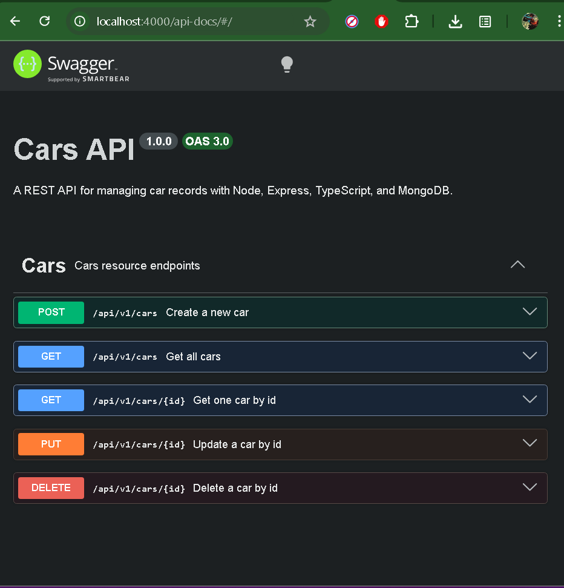
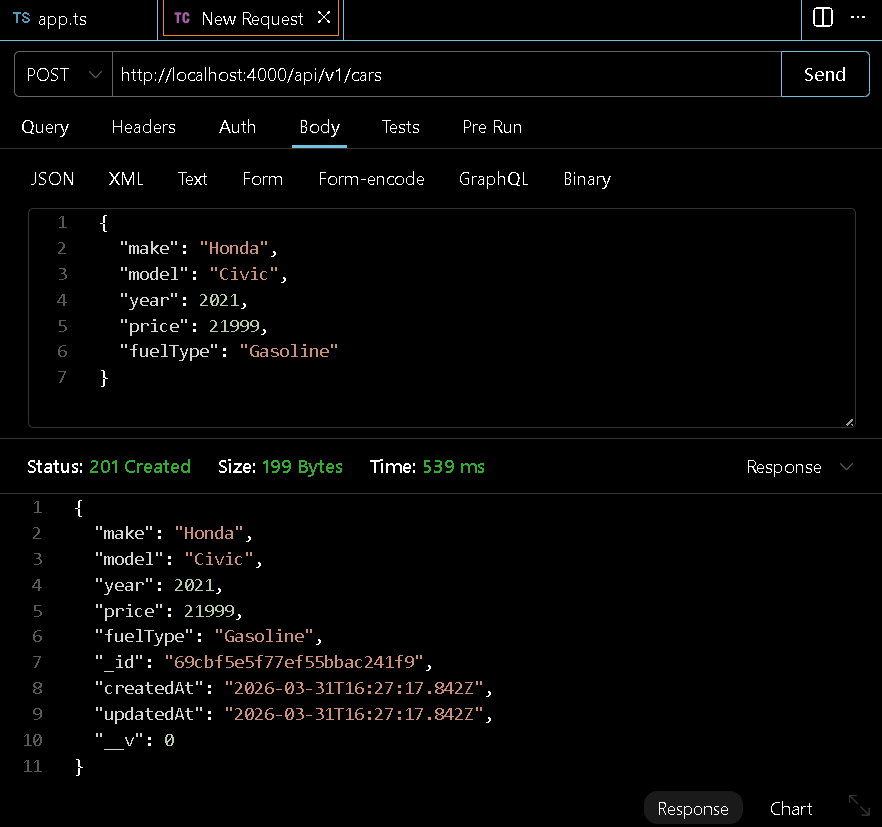
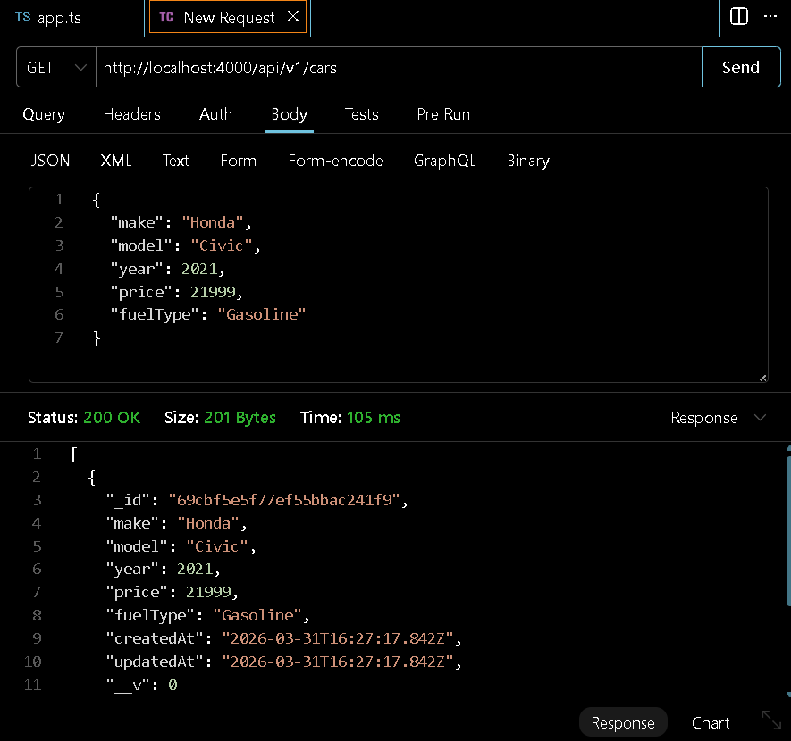
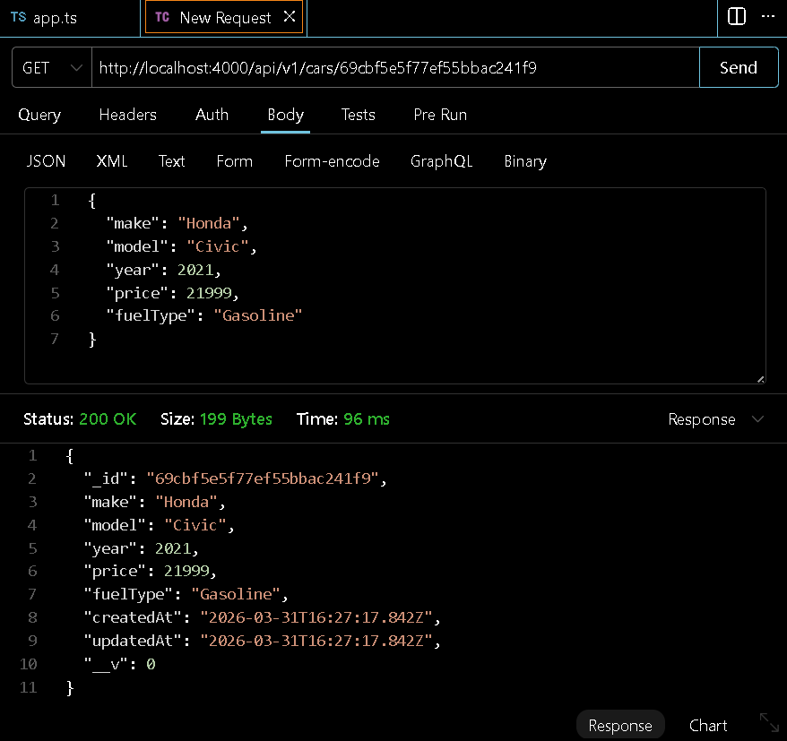
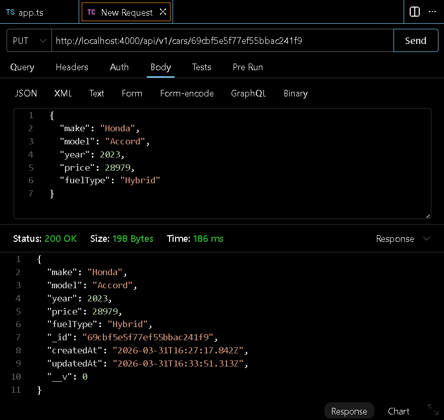
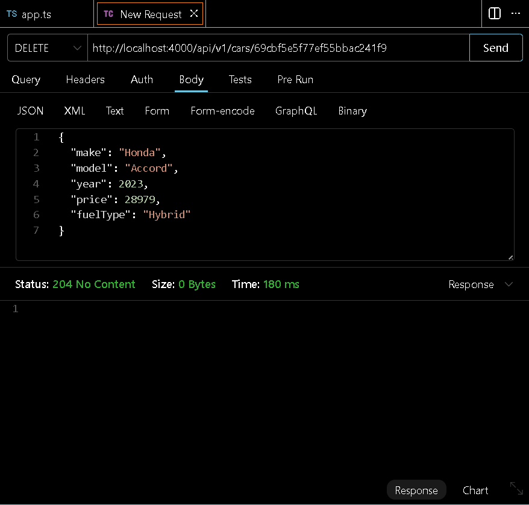
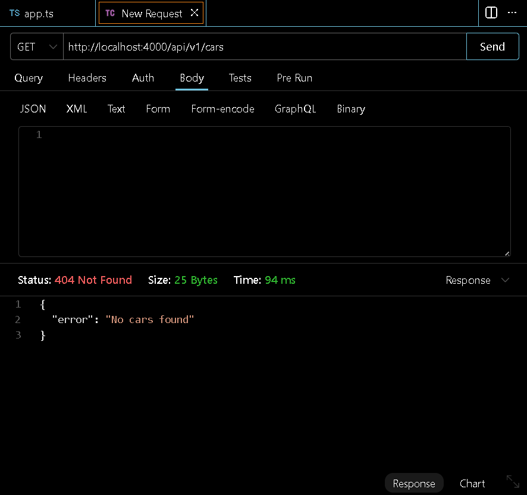

# Cars API

This project is a REST API built with Node.js, Express.js, TypeScript, MongoDB, and Swagger.

The goal of the project is to demonstrate CRUD operations, Mongoose validation, Express routing, and Swagger documentation.

The API manages a Cars resource and supports full CRUD operations:
- Create a car
- Read all cars
- Read one car by ID
- Update a car (DB Info)
- Delete a car (DB Info)

## Resource Fields

Each car document includes:
- `make`
- `model`
- `year`
- `price`
- `fuelType`

## Tech Stack

- Node.js
- Express.js
- TypeScript
- MongoDB with Mongoose
- Swagger for API documentation

## Routes

Base route:
`/api/v1/cars`

Endpoints:
- `POST /api/v1/cars`
- `GET /api/v1/cars`
- `GET /api/v1/cars/:id`
- `PUT /api/v1/cars/:id`
- `DELETE /api/v1/cars/:id`

Optional query filters:
- `GET /api/v1/cars?make=Toyota`
- `GET /api/v1/cars?fuelType=Hybrid`

Swagger docs:
- `/api-docs`

## Local Setup

1. Install dependencies:
   ```bash
   npm install

2. Create a .env file in the root of the project:
    ```bash
    DB=placeholder_your_mongodb_connection_string_here
    PORT=4000

3. Start the dev local server:
    ```bash
    npm run dev 

4. Build the TypeScript project:
    ```bash
    npm run build

Example JSON (Car Info for DB)
    ```bash
    {
    "make": "Toyota",
    "model": "Corolla",
    "year": 2022,
    "price": 24000,
    "fuelType": "Gasoline"
    }

## Testing Results

The following screenshots show the Cars API working locally in Thunder Client (VS Code) and Swagger.

### 0. Swagger documentation page loaded successfully
This screenshot shows the Swagger documentation interface for the Cars API running locally. It confirms that the application started successfully and that the POST, GET, PUT, and DELETE endpoints were registered and displayed correctly.


### 1. Swagger documentation loaded successfully


### 2. POST request successfully created a new car


### 3. GET request returned all cars


### 4. GET by ID returned the selected car


### 5. PUT request successfully updated the car


### 6. DELETE request successfully removed the car


### 7. Final GET request confirmed the list was empty after deletion

